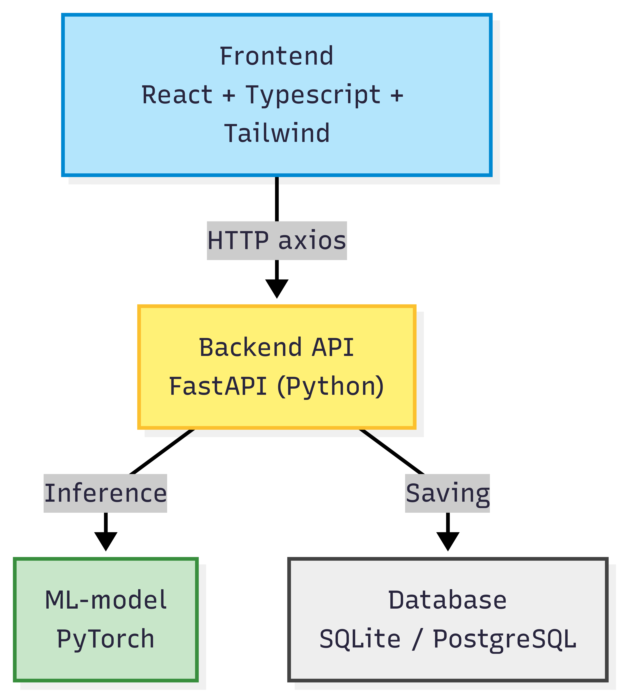

# Varustevahti
Repository for back end

## What the project does
The application indentifies ice hockey gear from a picture. The you can save the gear and it's info to the software. 
On the software you can keep track of your ice hockey gear and where it is located.

## Why the project is usefull
The project is usefull for people with lots of ice hockey gear. For example hockey families, who have many size of hockey gear and as children grow up, it is easy to keep track what you allready have. 

## application architecture

## Used Technologies

### Frontend
- **React + TypeScript** – for building the user interface.
- **Vite** – simple and fast development setup for React + Typescript projects. 
- **TailwindCSS or MUI** – to style the application.
- **Axios** – For making HTTP requests to the backend API.  

### Backend
- **FastAPI (Python)** – web framework for building our API. 
- **SQLite** – local development database  

### Machine Learning
- **PyTorch** – to load and run the image recognition model.

### Tools
- **Docker / Docker Compose** – to setup backend, machine learning and frontend all in one. 
- **GitHub** – for version control and collaboration.
- **pytest / Jest** – for testing backend and frontend.

