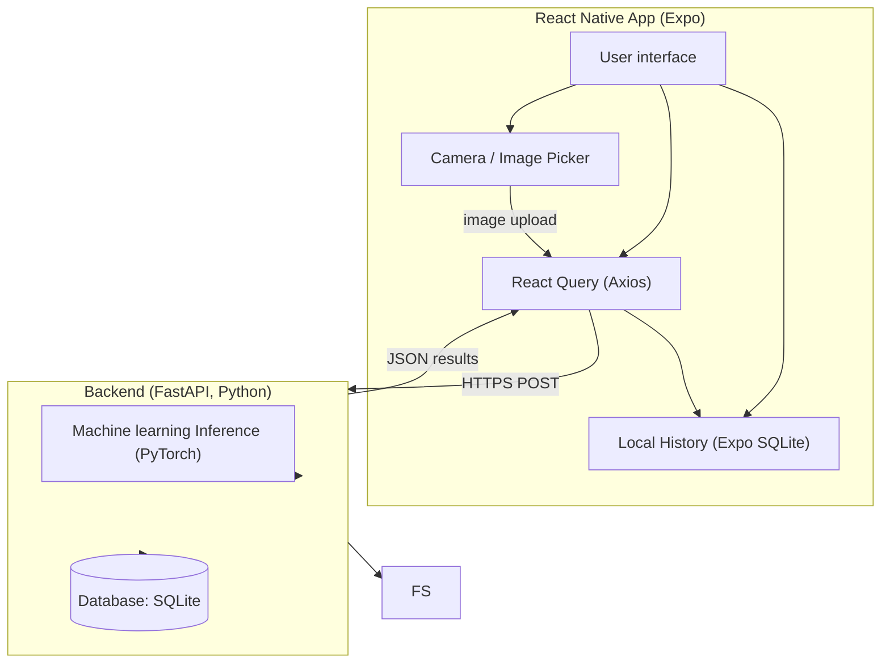

# Varustevahti

* Nico Pekkanen: Machine learning
* Timo Lampinen: User interface
* Daniel Thagapsov: Backend
* Jeremias Pajari: Development operations

## What the project does
The application is a smart inventory tool for tracking personal or shared equipment. Users can add items by taking a photo or selecting from the gallery, fill in details like name, category, location, and attach receipts. Groups make it possible for families or teams to manage shared items together, while the My Items page lets users browse, search, and filter their own gear.

## Why the project is usefull
The project is usefull for people with lots of ice hockey gear. For example hockey families, who have many size of hockey gear and as children grow up, it is easy to keep track what you allready have. 

## Application architecture




## Used Technologies

### Frontend
- **React Native, Expo** – Framework building the mobile app.
- **React Navigation** – Navigation between screens.
- **React Native Paper or NativeWind** – to style the mobile app.
- **Axios** – For making HTTP requests to the backend API.
- **Expo SQLite** - For local history storage inside the app.

### Backend
- **FastAPI (Python)** – backend API that receives images and returns recognition results. 
- **SQLite** – database for storing items and recognition history.

### Machine Learning
- **PyTorch** – to load and run the image recognition model.

### Tools
- **Docker / Docker Compose** – to setup backend, machine learning and frontend all in one. 
- **GitHub** – for version control and collaboration.
- **pytest / Jest** – for testing backend and frontend.

## Mockup pages (made in Google Stitch)
| First page | Add item page | Groups page |Inside of a group |
|:-----------|:------------:|------------:|------------:|
|       |        | |       |

## Booting instructions
1. Clone the repository

2. Create a virtual environment
**Windows**
```bash
python -m venv venv
```

**MacOS/Linux**
```bash
python3 -m venv venv
```

3. Activate the virtual environment

**Windows**
```bash
venv\Scripts\Activate
```

**MacOS/Linux**
```bash
source venv/bin/activate
```

4. Install the requirements

```bash
pip install -r requirements.txt
```

5. Run the application
```bash
uvicorn app.main:app --reload
```

6. Testing can be performed using the generated URL
```bash
http://127.0.0.1:8000/docs
```


