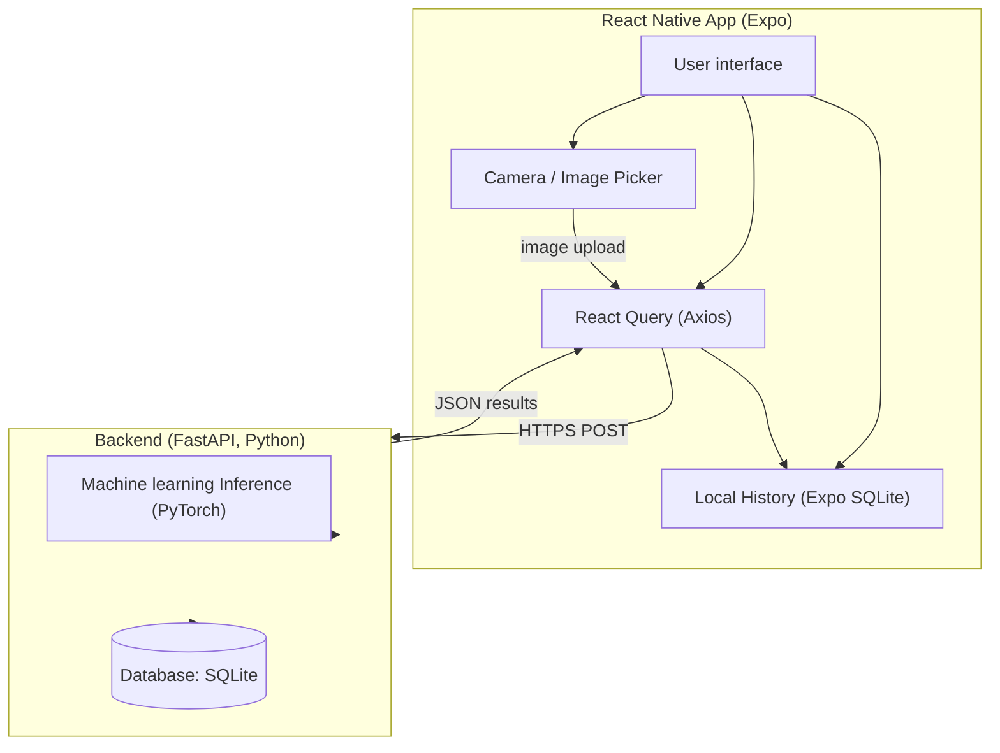

# Varustevahti

* Nico Pekkanen: Machine learning
* Timo Lampinen: User interface
* Daniel Thagapsov: Backend
* Jeremias Pajari: Development operations

---
<details>
  <summary><strong>About the Varustevahti</strong></summary>
<details>
  <summary><strong>What the project does</strong></summary>

  The application is a smart inventory tool designed for tracking personal or shared equipment.
  Users can add items by taking a photo or selecting from the gallery, and fill in details like
  name, category and location. Groups make it possible for families or teams to manage shared items
  together, while the My Items page lets users browse, search, and filter their own gear.

  The system includes a React Native (Expo) mobile frontend and a FastAPI backend deployed on CSC Rahti.
  The frontend is not deployed to App/Play stores due to cost, but can be fully used via Expo Go during development.
  User authentication is implemented with Clerk.
</details>

<details>
  <summary><strong>What is it?</strong></summary>
  
  Varustevahti is a mobile inventory tool for storing and organizing sports equipment.
  Users can add items by taking photos, track what they own, and manage group-based inventories
  such as family items or ice-hockey team gear.
</details>
</details>


<details>
  <summary><strong>Frontend (React Native + Expo)</strong></summary>

  Frontend repository: 
  https://github.com/Varustevahti/Frontend

  <details>
    <summary><strong>Used Technologies</strong></summary>

    - React Native, Expo – Framework for the mobile app  
      https://docs.expo.dev/

    - React Navigation – Page navigation  
      https://reactnavigation.org/

    - React Native Paper – UI components  
      https://callstack.github.io/react-native-paper/

    - Axios – HTTP requests  
      https://axios-http.com/docs/intro

    - Expo SQLite – Local history storage  
      https://docs.expo.dev/versions/latest/sdk/sqlite/
  </details>

  <details>
    <summary><strong>Mockup pages (Google Stitch) & color palette</strong></summary>

    | First page | Add item page | Groups page | Inside group |
    |------------|--------------:|-------------:|-------------:|
    |  |  |  |  |

    Color palette

    - Background: `#F8FBFA`  
    - Text: `#52946B`  
    - Selected Text: `#0D1A12`  
    - Fill: `#EAF2EC`  
    - Button: `#71DE86`  
  </details>

  <details>
    <summary><strong>Dependencies</strong></summary>

    react-native-paper  
    expo-image-picker  
    react-navigation  
    @react-navigation/native  
    @react-navigation/bottom-tabs  
    @react-navigation/native-stack  
    react-native-screens  
    react-native-safe-area-context  
    react-native-gesture-handler  
    react-native-reanimated  
    expo/vector-icons  
    expo-sqlite  
  </details>

</details>

---

### Cloning project:
git clone https://github.com/Varustevahti/Frontend.git
cd Frontend

### Install Expo environment
```bash
npx expo install
```
### Install dependencies
#### Expo
```bash
npx expo install react-native-paper expo-image-picker @react-navigation/native @react-navigation/bottom-tabs @react-navigation/native-stack @react-native-picker/picker react-native-safe-area-context react-native-screens @expo/vector-icons react-native-gesture-handler react-native-reanimated react-native-get-random-values expo-sqlite
```
#### NPM
```bash
npm install @react-navigation/native-stack @react-navigation/bottom-tabs
```
### To stars the project 
```bash
npx expo start

with

iOS-emulator
npx expo run:ios

Or

Android-emulator
npx expo run:android

Or

scan the QR code using Expo Go
```
---
<details>
 <summary><strong>If you want authentication</strong></summary>
  
You have to create .env file, and add your Clerk credentials to it.
Example:

  
CLERK_SECRET_KEY=YourOwnSecretKey
CLERK_ISSUER=YourOWnClerkIssuer
CLERK_JWKS_URL=YourOwnJWKSURL

</details>
---
<details>
 <summary><strong>Backend (FastAPI, Python)</strong></summary>


<details>
    <summary><strong>Application architecture</strong></summary>


</details>
<details>
 <summary><strong>Sequence diagram</strong></summary>
  ```mermaid
sequenceDiagram
    autonumber
    participant U as User
    participant FE as Expo Frontend (Mobile)
    participant BE as FastAPI Backend (Rahti)
    participant AI as AI_Model (torch)
    participant DB as SQLite /workspace/varustevahti.db

    %% --- Normal CRUD ---
    U ->> FE: User opens the application
    FE ->> BE: GET /items/
    BE ->> DB: Get all items
    DB -->> BE: Item list
    BE -->> FE: 200 OK + JSON
    FE -->> U: Show list

    %% --- Add new item ---
    U ->> FE: Fill item information
    FE ->> BE: POST /items/
    BE ->> DB: Add new item
    DB -->> BE: OK
    BE -->> FE: 200 OK

    %% --- recognition (items/auto) ---
    U ->> FE: Pick photo (camera / gallery)
    FE ->> BE: POST /items/auto

    BE ->> AI: Activate Ai-model
    AI ->> AI: Performs model inference
    AI -->> BE: Prediction (category, gear-type)

    BE ->> DB: Saves automaticly created info
    DB -->> BE: OK
    BE -->> FE: 200 OK + predicted data

    FE -->> U: Shows automaticly recognized item
```
</details>
<details>
<summary><strong>API documentation</strong></summary>

Our backend´s REST API contains items, categories and groups.

Endpoints explained: [docs/api.md](docs/api.md)

</details>
 <details>
 <summary><strong>Used technologies</strong></summary>

- FastAPI (Python) – backend API that receives images and returns recognition results.
  
  (Documentation: https://fastapi.tiangolo.com/)
  
- SQLite – database for storing items and recognition history.
  
  (Documentation: https://sqlite.org/docs.html)

</details>
<details>
<summary><strong>Machine Learning</strong></summary>

- PyTorch – to load and run the image recognition model.
  
  (Documentation: https://docs.pytorch.org/tutorials/index.html)

</details>
<details>
<summary><strong>Tools</strong></summary>

- Docker – to setup backend, machine learning and frontend all in one.
  
  (Documentation: https://docs.docker.com/)
  
- GitHub – for version control and collaboration.
  
  (Documentation: https://docs.github.com/en)
  
- CSC Rahti - Deployment
  
  (Documentation: https://docs.csc.fi/cloud/rahti/)

</details>
</details>
---

## Running backend locally
1. Clone the repository
   git clone https://github.com/Varustevahti/Backend.git
   cd Backend

3. Create a virtual environment
**Windows**
```bash
python -m venv venv
```

**MacOS/Linux**
```bash
python3 -m venv venv
```

3. Activate the virtual environment

**Windows**
```bash
venv\Scripts\Activate
```

**MacOS/Linux**
```bash
source venv/bin/activate
```

4. Install the requirements into the virtual environment

```bash
pip install -r requirements.txt
```

5. Run the application
```bash
uvicorn app.main:app --reload
```

6. Testing can be performed using the generated URL
```bash
http://127.0.0.1:8000/docs
```
---

## Docker instructions
### Build: 
docker build -t varustevahti-backend .
### Run:
docker run -p 8080:8000 varustevahti-backend


