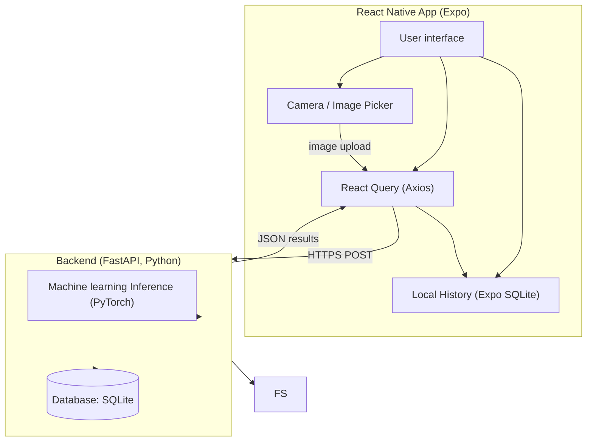
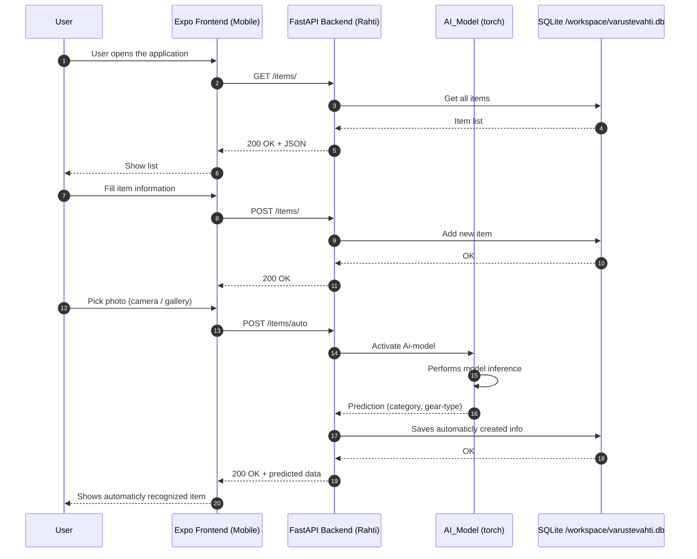

# Varustevahti

* Nico Pekkanen: Machine learning
* Timo Lampinen: User interface
* Daniel Thagapsov: Backend
* Jeremias Pajari: Development operations

### What the project does
The application is a smart inventory tool designed for tracking personal or shared equipment. Users can add items by taking a photo or selecting from the gallery, fill in details like name, category and location. Groups make it possible for families or teams to manage shared items together, while the My Items page lets users browse, search, and filter their own gear.
The system includes a React Native (Expo) mobile frontend and a FastAPI backend, which is deployed on CSC Rahti. Frontend is not deployed to App/play stores because of costs, but can be fully used via Expo Go during development. User authentication is implemented with Clerk

### Why the project is usefull
The project is usefull for people with lots of inventory but dont know where they are. For example hockey families, who have many size of hockey gear and as children grow up, it is easy to keep track what you already have. 

## Frontend (React Native + Expo)
Frontend repository:
https://github.com/Varustevahti/Frontend

### Mockup pages (made in Google Stitch)
| First page | Add item page | Groups page |Inside of a group |
|:-----------|:------------:|------------:|------------:|
|       |        | |

### Color palete
Background color #F8FBFA<br>
Text color #52946B <br>
Text color Selected #0D1A12 <br>
Fill color #EAF2EC <br>
Button color bright green #71DE86 <br>

### Dependencies
react-native-paper
expo-image-picker
react-navigation
@react-navigation/native (implied)
@react-navigation/bottom-tabs (implied)
react-native-screens (for react-navigation)
react-native-safe-area-context
react-native-gesture-handler
react-native-reanimated
expo/vector-icons

### Cloning project:
git clone https://github.com/Varustevahti/Frontend.git
cd Frontend

### Install Expo environment
npx expo install

### Install dependencies
#### Expo
npx expo install react-native-paper expo-image-picker @react-navigation/native @react-navigation/bottom-tabs @react-navigation/native-stack @react-native-picker/picker react-native-safe-area-context react-native-screens @expo/vector-icons react-native-gesture-handler react-native-reanimated react-native-get-random-values expo-sqlite

#### NPM
npm install @react-navigation/native-stack @react-navigation/bottom-tabs

### To stars the project 
npx expo start

with iOS-emulator
npx expo run:ios

Or Android-emulator
npx expo run:android

Or scan the QR code using Expo Go

### If you want authentication
You have to create .env file, and add your Clerk credentials to it.
Example:
```yaml
CLERK_SECRET_KEY=YourOwnSecretKey
CLERK_ISSUER=YourOWnClerkIssuer
CLERK_JWKS_URL=YourOwnJWKSURL
```

## Backend (FastAPI, Python)

### Used Technologies

- **React Native, Expo** – Framework building the mobile app.
- **React Navigation** – Navigation between screens.
- **React Native Paper** – to style the mobile app.
- **Axios** – For making HTTP requests to the backend API.
- **Expo SQLite** - For local history storage inside the app.

### Application architecture


### Sequence diagram



#### Used technologies
- **FastAPI (Python)** – backend API that receives images and returns recognition results. 
- **SQLite** – database for storing items and recognition history.

#### Machine Learning
- **PyTorch** – to load and run the image recognition model.

#### Tools
- **Docker** – to setup backend, machine learning and frontend all in one. 
- **GitHub** – for version control and collaboration.
- **CSC Rahti** - Deployment

   |

## Running backend locally
1. Clone the repository
   git clone https://github.com/Varustevahti/Backend.git
   cd Backend

3. Create a virtual environment
**Windows**
```bash
python -m venv venv
```

**MacOS/Linux**
```bash
python3 -m venv venv
```

3. Activate the virtual environment

**Windows**
```bash
venv\Scripts\Activate
```

**MacOS/Linux**
```bash
source venv/bin/activate
```

4. Install the requirements into the virtual environment

```bash
pip install -r requirements.txt
```

5. Run the application
```bash
uvicorn app.main:app --reload
```

6. Testing can be performed using the generated URL
```bash
http://127.0.0.1:8000/docs
```
## Docker instructions
### Build: 
docker build -t varustevahti-backend .
### Run:
docker run -p 8080:8000 varustevahti-backend


